# 在dc上安裝AD Service
* 共3臺電腦 dc, db1, db2
* install dns & ad roles
* promote server to domain controller
* add a new forest, i input 17test.local (注意要有 dot)
* 過程中提昇本地端的帳號到AD, 會要求帳號的密碼是符合其要求的原則。

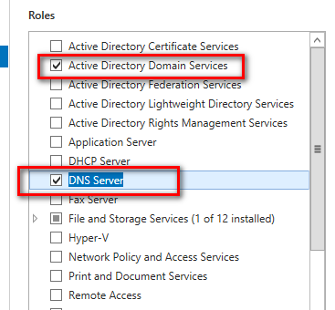  

# 安裝 db1, db2 與啟用 Failover Clustering

* 切換2臺db的dns指向 ad 的ip  
* 加入網域 17test.local，
* 重啟後仍然登入本機帳號，將要安裝clustering的ad帳號加入本機管理者群組
* 重新登入，改用ad帳號登入
* 安裝Failover clustering功能.見圖

* 開啟 Failover Cluster Manager
* Selected server 加入 db1, db2
* 驗證過程中一堆紅字，但還是可以選擇建立
* Cluster Name我輸入 17on
* 這時在AD上的computers ，可以看到多出 17on
* db2用Failover Cluster Manager 也可以Slect Cluster 17on 見圖


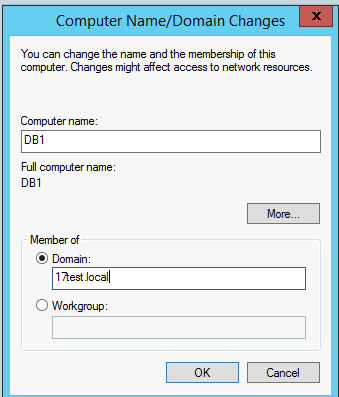  
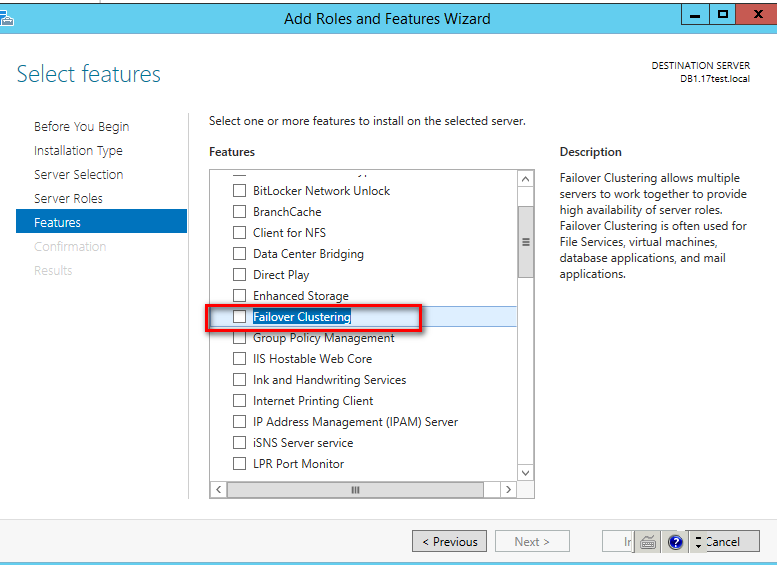  
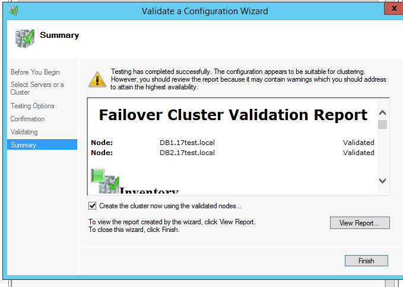  
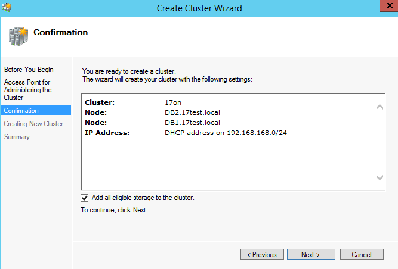  
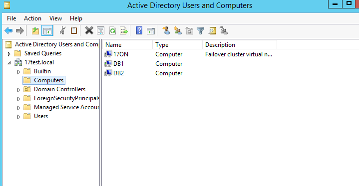  

# Clustering 使用檔案(網路分享)見證
* db1上操作 cluster manager ，在 more action 選增加投票者，見圖10
* 選 select the quorum witness
* 選 configure a file share witness (add a quorum vote of the file share witness)
* 設定 \\dc\share
* 到dc電腦上建立一個資料夾share，並分享給everyone 且要能寫入(是的 evenyone)
* 設好後應該要看到 File Share Withness(\\dc\share) 是 Online 狀態, 見圖11
* 設定好檔案見證，可在db1 用sql管理工具查目前投票的節點 見圖12

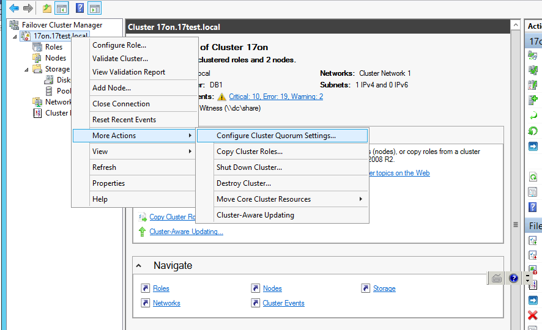  
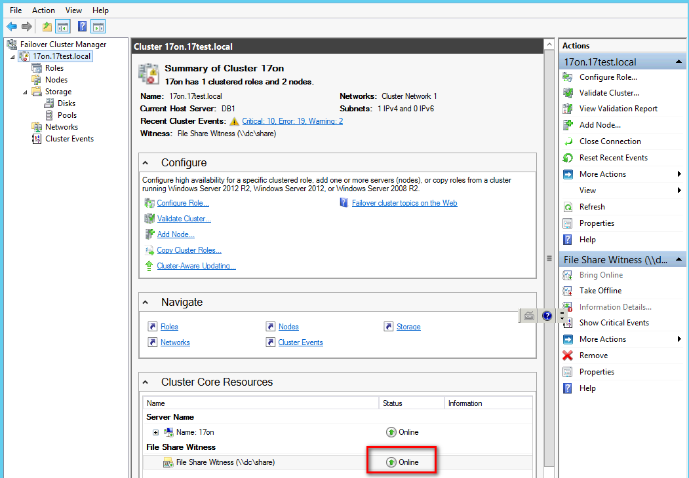  
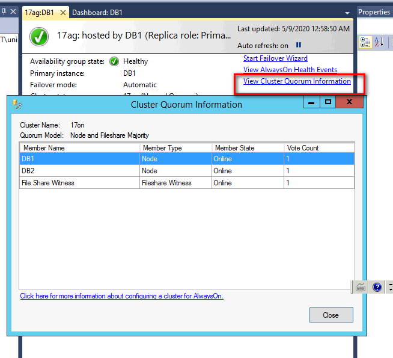  

# SqlServer 建立 Awlayson Group
* 建立一個要執行alwayson的ad帳號, sqlagent ，給他domain admin權限
* 用 ad\sqlagent 身份執行 SqlServer service
* sql server configuration manager 把 always on 功能啟用並里啟服務
* availability group name 我設 17ag
* 連不到第2臺是記得要開啟防火牆 1433,5022
* SQL Server network Configuration 也要把 Named Pipes, TCPI/IP 打開，有調整服務要重啟
* 
er DNS Name 我設17db(alwayson的虛擬連線主機), port設1433, 設了IPv4 192.168.168.253 (253我隨意指定)

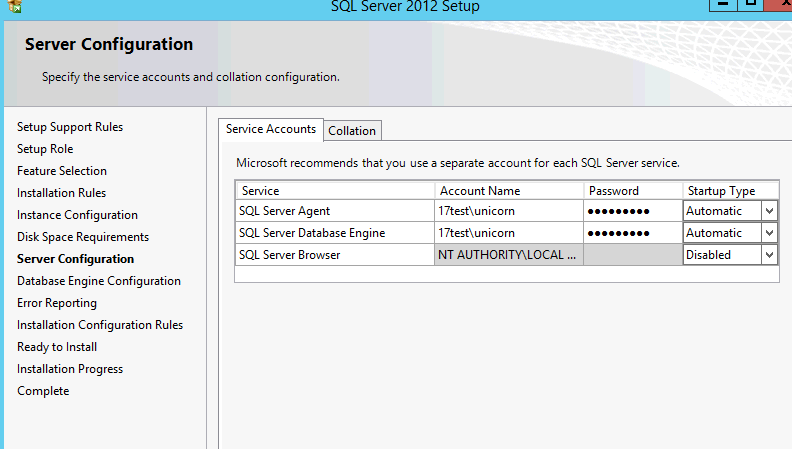  
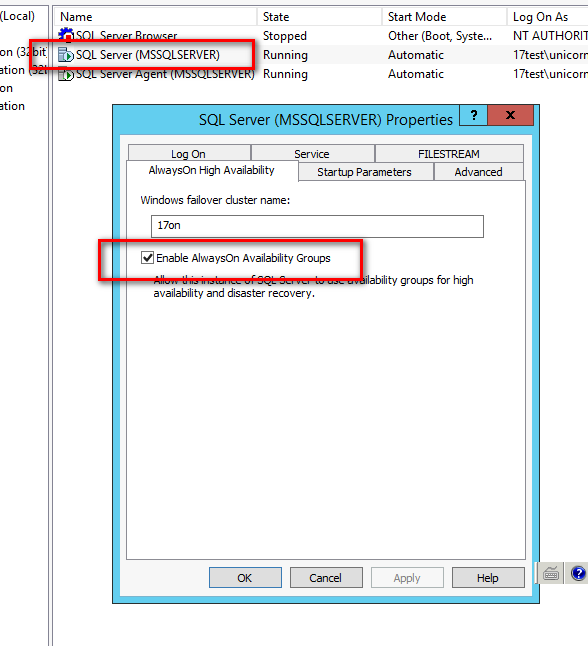  


# 已有Alwayson Group，要加入新資料庫
* Select Data Synchronizaition 我是選 join only，這會造成 error ，但可先不管
* 到db2 手動還原從db1拿到的完整備份檔，選 restore with norecovery
* 然後再 db2 的always on 裏的 Availablity databases 那 操作該db使其 join to availability group


1. 來源Database先備份
```sql
BACKUP DATABASE [lunchking_UAT] TO  DISK = N'C:\share\lunchking_uat.bak' 
WITH FORMAT, INIT,COMPRESSION,  NAME = N'lunchking_UAT'
GO
backup log [lunchking_UAT] TO  DISK
= 'C:\share\lunchking_uat.trn'
with init
```

2. 把備份好的檔案複製到目的伺服器，進行還原
```sql
restore database lunchking_UAT
from DISK = 'E:\dbbak\lunchking_uat2.bak'
with norecovery,
move 'lunchking_new' to 'C:\DATA\lunchking_UAT.mdf',
move 'lunchking_new_log' to 'C:\DATA\lunchking_UAT_log.ldf'
go
restore database lunchking_UAT
from disk = 'E:\dbbak\lunchking_uat2.trn'
with norecovery
```

3. 在來源伺服器，加入資料庫到alwayson
```sql
alter availability group 
[17alwayson] add database lunchking_UAT
```

4. 在目的伺服器，啟用高可用性同步
```sql
alter database lunchking_UAT 
set hadr availability group = [17alwayson]
```

5. 查詢目前AG投票節點
```sql
SELECT  member_name, member_state_desc, number_of_quorum_votes  
 FROM   sys.dm_hadr_cluster_members;
```

6. 如果為偶數，可以增加網芳分享的見證投票節點，目前是用AD的伺服器開分享目錄，權限設everyone讀寫


7. 查詢db的檔案位置
```sql
SELECT
    db.name AS DBName,
    type_desc AS FileType,
    Physical_Name AS Location
FROM
    sys.master_files mf
INNER JOIN 
    sys.databases db ON db.database_id = mf.database_id
	
```

8. 產生還原的 restore 指令，包含 差異備份的還原
```sql
DECLARE @databaseName sysname 
DECLARE @databaseRowsName nvarchar(100)
DECLARE @databaseLogName nvarchar(100)
DECLARE @targetDatabaseName sysname 
DECLARE @backupStartDate datetime 
DECLARE @backup_set_id_start INT 
DECLARE @backup_set_id_end INT 

DECLARE @targetFolder nvarchar(100)

-- set database to be used 
SET @databaseName = 'lunchking' 
SET @targetDatabaseName = 'skm' 
SET @targetFolder = 'E:\DATA\'

SET @databaseRowsName = (
SELECT TOP 1 mf.name
FROM
    sys.master_files mf
INNER JOIN 
    sys.databases db ON db.database_id = mf.database_id
where db.name = @databaseName and mf.type_desc = 'ROWS')

SET @databaseLogName = (
SELECT TOP 1 mf.name
FROM
    sys.master_files mf
INNER JOIN 
    sys.databases db ON db.database_id = mf.database_id
where db.name = @databaseName and mf.type_desc = 'LOG')


SELECT @backup_set_id_start = MAX(backup_set_id) 
FROM msdb.dbo.backupset 
WHERE database_name = @databaseName AND type = 'D' 

SELECT @backup_set_id_end = MIN(backup_set_id) 
FROM msdb.dbo.backupset 
WHERE database_name = @databaseName AND type = 'D' 
AND backup_set_id > @backup_set_id_start 

IF @backup_set_id_end IS NULL SET @backup_set_id_end = 999999999 

SELECT backup_set_id, 'RESTORE DATABASE ' + @targetDatabaseName + ' FROM DISK = ''' + mf.physical_device_name + ''' WITH ' + 
'MOVE N''' + @databaseRowsName +''' TO N''' + @targetFolder + @targetDatabaseName + '.mdf'', ' +
'MOVE N''' + @databaseLogName +''' TO N''' + @targetFolder + @targetDatabaseName + '_log.ldf'', ' +
--'MOVE N'lunchking_new' TO N'E:\DATA\skm_data.mdf',  MOVE N'lunchking_new_log' TO N'E:\DATA\skm_log.log'' +
'NORECOVERY' 
FROM msdb.dbo.backupset b, 
msdb.dbo.backupmediafamily mf 
WHERE b.media_set_id = mf.media_set_id 
AND b.database_name = @databaseName 
AND b.backup_set_id = @backup_set_id_start 
UNION 
SELECT backup_set_id, 'RESTORE LOG ' + @targetDatabaseName + ' FROM DISK = ''' + mf.physical_device_name + ''' WITH NORECOVERY' 
FROM msdb.dbo.backupset b, 
msdb.dbo.backupmediafamily mf 
WHERE b.media_set_id = mf.media_set_id 
AND b.database_name = @databaseName 
AND b.backup_set_id >= @backup_set_id_start AND b.backup_set_id < @backup_set_id_end 
AND b.type = 'L' 
UNION 
SELECT 999999999 AS backup_set_id, 'RESTORE DATABASE ' + @targetDatabaseName + ' WITH RECOVERY' 
ORDER BY backup_set_id
```


# 錯誤排除
## ERROR 41105 - SQL Server 建立 availability group 時發生錯誤
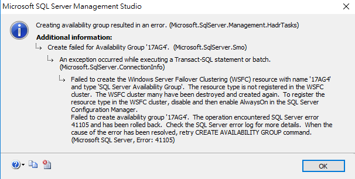
>原因:  
>```推測可能是 SqlServer 與 Clustering 安裝順序，造成 lustering 無法辨識 SqlServer 需要的resource type```  
>確認:用管理者身份開啟PowerShell，執行底下指令查詢，如果查結果即可確認。  
>```Get-ClusterResourceType | where name -like "SQL Server Availability Group"```  
>處理:  
>```Add-ClusterResourceType -Name "SQL Server Availability Group" -DisplayName "SQL Server Availability Group" -Dll "C:\Windows\System32\hadrres.dll"  ```  
>```要 Disable SqlServer 的 Alwayson 服務，重新 Enable

## ERROR 41006 - SQL Server 建立 availability group 時發生錯誤
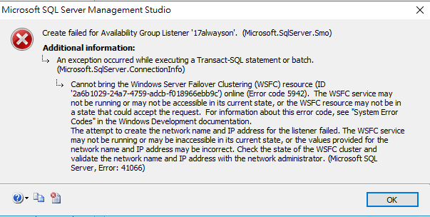  
>原因: 重新註冊 Clustering 的 Resource type，未重啟相關服務  
>處理:  
>```要 Disable SqlServer 的 Alwayson 服務，重新 Enable```  


#參考連結
https://www.mssqltips.com/sqlservertip/5437/adding-a-database-to-an-existing-sql-server-always-on-configuration/