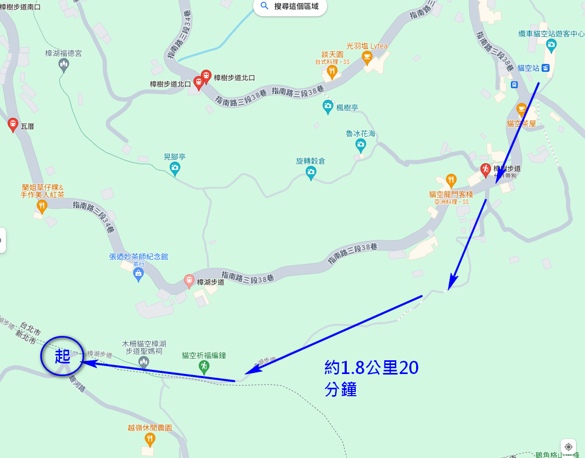

# 山頂鳥-台北郊山過五關
## 暫訂時間 2024/07/05(星期五)
- 07:00 搭公車1717
- 08:10 小觀音停車場
- 08:20 小油坑遊客中心
- 09:10 七星山
- 10:05 冷水坑遊客中心 
- 10:30 小15 20分鐘一班車 (邊等車，邊自行乾糧補給)
- 11:20 劍潭站
- 11:35 劍潭登山步道 開始
- 12:15 劍潭登山步道 結束
- 13:30 劍潭站
- 14:10 西湖附近午餐時間 
    - [Burger Behind The Door](https://maps.app.goo.gl/g2UhCo8Cb1coGQ427)
    - [純豆花冰品專門店](https://maps.app.goo.gl/RSZ2p8CRyV23bW1P6)
- 14:50 用餐結束
- 15:00 金面山登山口 開始
- 16:10 金面山登山口 結束
- 16:50 至捷運動物園站 
- 17:00 搭公車 ([貓空左線](https://ebus.gov.taipei/EBus/VsSimpleMap?routeid=0162002200), [棕15](https://ebus.gov.taipei/EBus/VsSimpleMap?routeid=0114001500&gb=0)，見附錄二)
- 17:30 公車到 貓空纜車站
- 17:50 至樟湖步道往銀河洞登山口 (見附錄三)
- 17:50 銀河洞登山口 開始
- 18:50 銀河洞登山口 結束
- 19:10 貓空纜車站
- 20:10 象山站
- 20:25 象山 開始
- 21:05 象山 結束
- 21:15 象山站
- 21:40 北車


### 附錄一 台北捷運圖


### 附錄二 動物園站往貓纜站
```
13:30 棕15
14:10 貓空左線
14:40 棕15
15:00 貓空左線
15:30 棕15
16:00 貓空左線
16:30 棕15
17:00 貓空左線
17:30 棕15
```

### 附錄三 貓纜到銀河洞登山口


### 附錄四 飲水補給
- 台鐵北一進入
- 冷水坑遊客中心
- 小油坑遊客中心
- 劍壇捷運(站外)
- 西湖捷運靠2出口 (站內)
- 新店捷運出口 (站內)